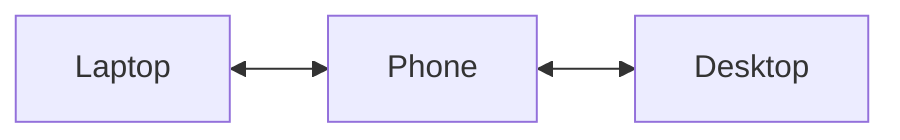
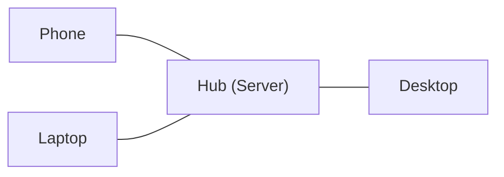

import LanguageTabs from '@site/src/components/LanguageTabs';
import TabItem from '@theme/TabItem';

# Mesh Routing

Mesh routing enables multi-hop message delivery through trusted peers. When two devices cannot connect directly, messages are routed through intermediate peers that both can reach.

## When to Use Mesh Routing

Mesh routing is useful when you have 3 or more devices and some cannot reach each other directly. Instead of relying on a central relay server, messages are forwarded through trusted peers.

**Example scenario:**



The laptop and desktop cannot connect directly (e.g., different networks, strict NAT), but both can reach the phone. With mesh routing enabled, the phone automatically relays traffic between them -- all end-to-end encrypted.

## Enabling Mesh Mode

Enable mesh routing when creating a node:

<LanguageTabs>
<TabItem value="rust">

```rust
use cairn_p2p::{CairnConfig, create};

let config = CairnConfig {
    mesh_enabled: true,
    ..CairnConfig::default()
};
let node = create(config)?;
node.start().await?;
```

</TabItem>
<TabItem value="typescript">

```typescript
import { Node } from 'cairn-p2p';

const node = await Node.create({
    meshEnabled: true,
});
```

</TabItem>
<TabItem value="go">

```go
import cairn "github.com/moukrea/cairn/packages/go/cairn-p2p"

config := cairn.DefaultConfig()
config.MeshEnabled = true
node, _ := cairn.Create(config)
```

</TabItem>
<TabItem value="python">

```python
from cairn import create

node = await create(mesh_enabled=True)
```

</TabItem>
<TabItem value="php">

```php
use Cairn\Node;

$node = Node::create(['meshEnabled' => true]);
```

</TabItem>
</LanguageTabs>

## Topology and Routing Behavior

- **Automatic route discovery**: Mesh peers automatically discover multi-hop routes. No manual configuration of routing tables is needed.
- **End-to-end encryption**: Traffic is encrypted between the source and destination. Relay peers forward ciphertext and cannot read message content.
- **Dynamic routing table**: The routing table is maintained automatically as peers join, leave, or change connectivity. Routes adapt to network changes in real time.

## Use Case: Multi-Device File Sync Through a Hub

A common pattern is to designate one device as an always-on hub (using [server mode](/docs/guides/server-mode)) while other devices sync through it.



The hub:
- **Relays messages** between devices that are not directly connected
- **Stores messages** for offline devices (store-and-forward via server mode)
- **Syncs data** across all connected devices automatically

<LanguageTabs>
<TabItem value="rust">

```rust
// Hub node: server mode + mesh
let config = CairnConfig {
    server_mode: true,
    mesh_enabled: true,
    ..CairnConfig::default()
};
let hub = create(config)?;
hub.start().await?;

// Client node: mesh enabled, connects to hub
let client_config = CairnConfig {
    mesh_enabled: true,
    ..CairnConfig::default()
};
let client = create(client_config)?;
client.start().await?;
let session = client.connect(&hub_peer_id).await?;
session.send("sync", b"file update").await?;
```

</TabItem>
<TabItem value="typescript">

```typescript
// Hub node: server mode + mesh
const hub = await Node.create({
    serverMode: true,
    meshEnabled: true,
});

// Client node: mesh enabled, connects to hub
const client = await Node.create({ meshEnabled: true });
const session = await client.connect(hubPeerId);
await session.send('sync', Buffer.from('file update'));
```

</TabItem>
<TabItem value="go">

```go
// Hub node: server mode + mesh
hubConfig := cairn.DefaultConfig()
hubConfig.ServerMode = true
hubConfig.MeshEnabled = true
hub, _ := cairn.Create(hubConfig)

// Client node: mesh enabled, connects to hub
clientConfig := cairn.DefaultConfig()
clientConfig.MeshEnabled = true
client, _ := cairn.Create(clientConfig)
session, _ := client.Connect(hubPeerID)
session.Send("sync", []byte("file update"))
```

</TabItem>
<TabItem value="python">

```python
# Hub node: server mode + mesh
hub = await create(server_mode=True, mesh_enabled=True)

# Client node: mesh enabled, connects to hub
client = await create(mesh_enabled=True)
session = await client.connect(hub_peer_id)
await session.send("sync", b"file update")
```

</TabItem>
<TabItem value="php">

```php
// Hub node: server mode + mesh
$hub = Node::create(['serverMode' => true, 'meshEnabled' => true]);

// Client node: mesh enabled, connects to hub
$client = Node::create(['meshEnabled' => true]);
$session = $client->connect($hubPeerId);
$session->send('sync', 'file update');
```

</TabItem>
</LanguageTabs>

With this setup, any device can send a message to any other device -- the hub automatically routes it through the mesh, even if the sender and receiver have never connected directly.
