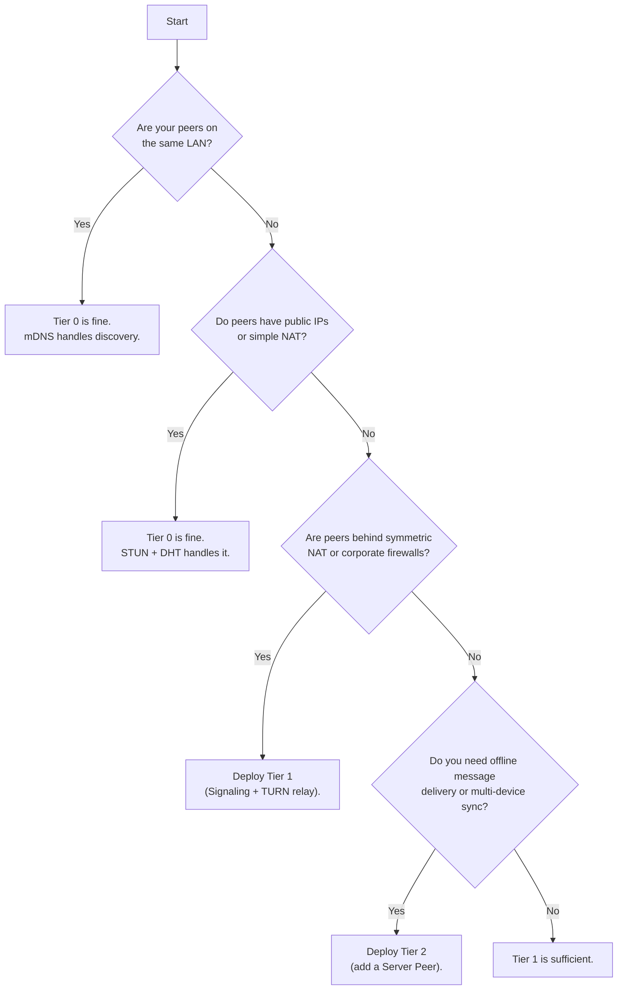

# Infrastructure Overview

cairn works out of the box with zero infrastructure. Here's when and why you'd want to add your own servers.

## Tier Comparison

|                      | Tier 0 (Default)            | Tier 1 (Signaling + Relay)     | Tier 2 (Server Peer)           |
|----------------------|-----------------------------|--------------------------------|--------------------------------|
| **Setup**            | None                        | 2 Docker containers            | 3 Docker containers            |
| **NAT traversal**    | Public STUN, best-effort    | TURN relay, symmetric NAT      | Full                           |
| **Discovery speed**  | 5-30s (DHT/mDNS)           | &lt;1s (signaling)             | &lt;1s                         |
| **Offline messages** | No                          | No                             | Yes (store-and-forward)        |
| **Always-on relay**  | No                          | Yes                            | Yes                            |
| **Multi-device sync**| Manual                      | Manual                         | Automatic (hub)                |
| **Cost**             | Free                        | Free (Cloudflare) or ~$5/mo VPS | Same + storage               |

### Tier 0: Zero Infrastructure

The default. Peers discover each other via mDNS on the local network or DHT over the internet. NAT traversal uses public STUN servers. Works well when peers have public IPs, are on the same LAN, or are behind simple NATs.

### Tier 1: Signaling + Relay

Add a **signaling server** for fast peer discovery and a **TURN relay** for reliable NAT traversal. Two lightweight Docker containers. Peers connect in under a second, and the relay handles symmetric NATs and corporate firewalls that block direct connections.

### Tier 2: Server Peer

Add a **server-mode peer** alongside signaling and relay. The server peer provides store-and-forward messaging (offline peers receive messages when they reconnect), personal relay capabilities, and acts as a hub for multi-device synchronization.

## Decision Flowchart

Use this to determine which tier you need:

## Next Steps

- [Signaling Server](/docs/infrastructure/signaling) -- deploy the signaling server for fast peer discovery
- [Relay Server](/docs/infrastructure/relay) -- deploy the TURN relay for NAT traversal
- [Server Node](/docs/infrastructure/server-node) -- deploy a server-mode peer for store-and-forward and multi-device sync
- [Cloudflare Deployment](/docs/infrastructure/cloudflare) -- deploy infrastructure for free on Cloudflare
