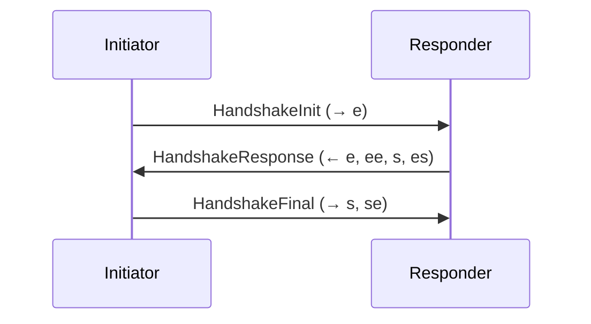

# Cryptography

cairn uses a layered cryptographic design to provide identity, authenticated key exchange, and forward-secret session encryption. All cryptographic operations run on-device -- private keys never leave the peer.

## Identity Keys

Each cairn node generates an **Ed25519** key pair on first run:

- **Public key**: Serves as the node's identity. The PeerID is derived by computing the SHA-256 hash of the public key, then encoding it as a multihash (prefix `0x12 0x20` + 32-byte hash), displayed in base58.
- **Private key**: Stored locally and never transmitted. Used to sign handshake messages and prove identity to peers.

The Ed25519 key pair is deterministically derived from a 32-byte seed, which is the root secret for the node's identity.

## Key Exchange

cairn uses **X25519 Diffie-Hellman** key exchange to establish shared secrets between peers. X25519 provides:

- 128-bit security level (equivalent to a 3072-bit RSA key).
- Ephemeral key pairs for each session, ensuring no long-term shared secret is stored.
- Integration with the Noise framework for authenticated key exchange.

## Noise XX Handshake

The session handshake follows the **Noise XX** pattern, a three-message authenticated key exchange:

**Message breakdown:**

1. **`-> e`**: Initiator sends an ephemeral X25519 public key.
2. **`<- e, ee, s, es`**: Responder sends its ephemeral key, performs DH between both ephemeral keys (`ee`), reveals its static identity key (`s`), and performs DH between the initiator's ephemeral and responder's static key (`es`).
3. **`-> s, se`**: Initiator reveals its static identity key (`s`) and performs DH between its static key and the responder's ephemeral key (`se`).

After completion, both peers have:
- Mutually authenticated each other's identity (static Ed25519 keys).
- Derived symmetric encryption keys for the session.
- Established ephemeral keys that provide forward secrecy.

## SPAKE2 PAKE (Pairing)

Before the Noise XX handshake can run, peers need to discover each other and establish initial trust. cairn uses **SPAKE2** (Simple Password Authenticated Key Exchange v2) during pairing:

- The pairing method (PIN, QR code, or link) provides a shared secret known to both peers.
- SPAKE2 derives a strong shared key from this secret without revealing it to observers.
- Even if an attacker intercepts the exchange, they cannot recover the PIN or derive the shared key without knowing the original secret.
- The SPAKE2-derived key bootstraps the Noise XX handshake, authenticating the initial connection.

**Security properties:**
- Offline dictionary attacks are infeasible (the protocol is balanced PAKE).
- The shared secret is never transmitted, even in encrypted form.
- Each pairing session uses fresh ephemeral values.

## Double Ratchet (Session Encryption)

After the Noise XX handshake completes, the **Double Ratchet** algorithm manages ongoing message encryption:

- **Symmetric ratchet**: Each message derives a unique encryption key from a chain key. After encryption, the message key is deleted and the chain key advances.
- **DH ratchet**: Periodically, peers exchange new ephemeral DH keys, performing a new key agreement that resets the chain. This provides break-in recovery.

**Properties:**
- **Unique key per message**: No two messages share the same encryption key.
- **Forward secrecy**: Compromising the current ratchet state does not reveal keys for past messages, because previous chain keys and message keys have been deleted.
- **Break-in recovery**: If an attacker compromises the current state, security is restored after the next DH ratchet step introduces new keying material the attacker does not have.
- **Out-of-order delivery**: Message keys can be stored briefly to handle messages that arrive out of order, then deleted after use.

## Forward Secrecy Guarantees

cairn provides forward secrecy at three levels:

### Per-Message Forward Secrecy

Each message key is derived from the symmetric ratchet chain and deleted immediately after use. An attacker who obtains a message key can only decrypt that single message.

### Session Forward Secrecy

Session keys are ephemeral, derived from the Noise XX handshake using ephemeral X25519 key pairs. These keys are never stored long-term. When a session ends, all session keying material is erased.

### Pairing Forward Secrecy

The SPAKE2 exchange produces ephemeral keys during pairing. The PIN, QR code, or link data alone is not sufficient to decrypt past sessions. Even if the pairing secret is later compromised, previously established sessions remain secure.
